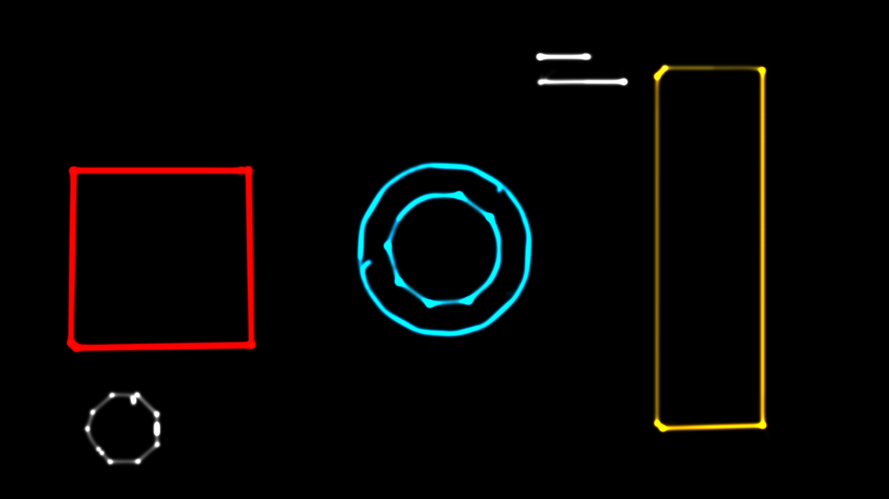
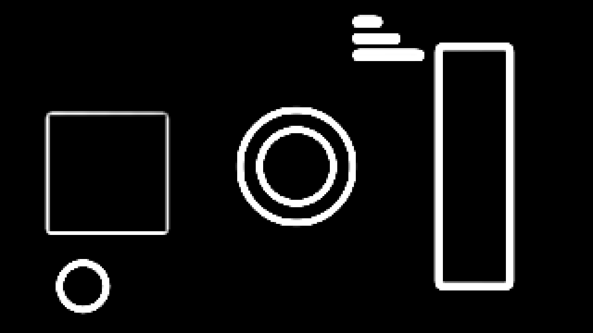
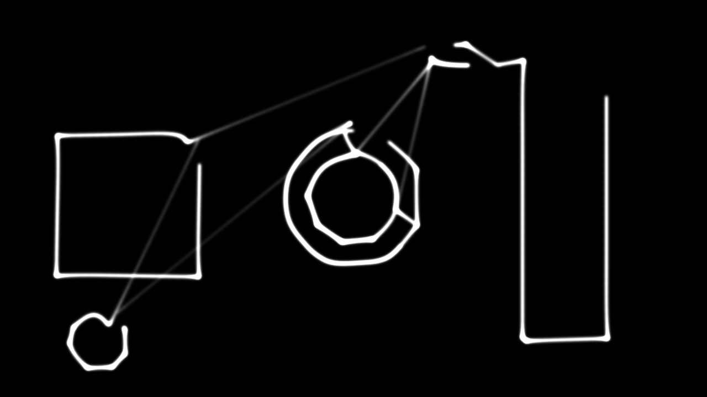

# galvo

> **AI-assisted project.** This codebase was created with [Claude](https://claude.com/claude-code)
> (Anthropic), directed and reviewed by a human author. The physics is verified
> numerically by an offline harness that drives the real classes — the galvo's
> step response against the exact second-order closed form, the light in a
> frame against the analytic energy, a corner's brightness against what its
> dwell points predict, and the contour tracer against shapes whose answer is
> known (see [Status](#status)). It has been registered, loaded and
> instantiated in **Resolume Arena 7.27.1 on Windows**, with the shaders
> compiling — but that was on a **software rasteriser**, so it has **never run
> on a GPU in Resolume**, has never been instantiated in Arena on macOS, and
> has never driven a real laser. Check it in your own rig before trusting it in
> front of an audience.

An ILDA laser projector, as an FFGL effect for [Resolume](https://resolume.com)
Arena and Avenue. It finds the outlines in a clip and scans them the way a real
projector does — two galvanometer mirrors chasing a point stream at a fixed
rate — so what you see is where the beam went and how long it lingered there.



<sub>The repo's test card scanned at 30 kpps. Note the bright dots at every
corner and the soft trail on the ring — neither is drawn. Rendered by `gvtest`,
the offline harness.</sub>

<!-- downloads:start -->

## Download

**[v0.1.0](https://github.com/stoatworks-labs/galvo/releases/tag/v0.1.0)** — prebuilt for macOS and Windows. Pick your platform:

<details>
<summary><b>macOS</b> — Universal (Apple Silicon + Intel)</summary>

| Build | Download | Size |
| --- | --- | --- |
| Universal (Apple Silicon + Intel) · .dmg disk image | [`galvo-0.1.0-macos-universal.dmg`](https://github.com/stoatworks-labs/galvo/releases/download/v0.1.0/galvo-0.1.0-macos-universal.dmg) | 247 KB |
| Universal (Apple Silicon + Intel) · .zip archive | [`galvo-macos-universal.zip`](https://github.com/stoatworks-labs/galvo/releases/latest/download/galvo-macos-universal.zip) | 208 KB |

</details>

<details>
<summary><b>Windows</b> — x64</summary>

| Build | Download | Size |
| --- | --- | --- |
| x64 · .exe installer | [`galvo-0.1.0-windows-x86_64-setup.exe`](https://github.com/stoatworks-labs/galvo/releases/download/v0.1.0/galvo-0.1.0-windows-x86_64-setup.exe) | 233 KB |
| x64 · .zip archive | [`galvo-windows-x86_64.zip`](https://github.com/stoatworks-labs/galvo/releases/latest/download/galvo-windows-x86_64.zip) | 129 KB |

</details>

All builds, checksums and release notes: [github.com/stoatworks-labs/galvo/releases](https://github.com/stoatworks-labs/galvo/releases).

macOS builds are signed and notarised and open normally. The Windows builds are unsigned, so SmartScreen warns once.

<!-- downloads:end -->

## The one idea

A laser show is **a path scanned by two mirrors with a finite point budget.**
The picture is where the beam went, at the brightness its dwell time gave it.
Nothing else is drawn.

Everything anybody recognises about laser graphics falls out of that:

- **Corners have bright dots.** A sharp vertex is sent to the scanner several
  times over, so the beam sits there with nowhere to go and the light piles up.
  That is what `Corner Dwell` is, and it is why a laser-drawn square has four
  bright studs on it.
- **Corners round off at speed.** A galvo is a mass on a spring. Wind `Galvo
  Speed` down from 60 kpps to 8 and the mirrors stop keeping up: the corners
  soften, then the whole figure starts to look like handwriting.
- **A scanner rings.** `Damping` below 1 makes the mirror overshoot a corner
  and come back through it. Above 1 it never overshoots and rounds everything.
- **Mis-set blanking draws hooks and tails.** `Blanking Delay` shifts the beam's
  on/off against the mirrors' position. Negative brings the beam on early, so
  it paints the approach to a stroke as a hook leading into it.
- **A busy frame flickers and crawls.** The scanner draws `pps ÷ frame rate`
  points per host frame and *continues where it left off*. Give it more path
  than that and the drawing appears over several frames, visibly crawling —
  which is exactly what a real projector does with a frame that is too busy.
  `Scan Rate Floor` thins the stream to keep the rate up, the way show software
  does.

Turn `Galvo Speed` down and `Corner Dwell` up and it stops looking like a
computer drawing lines. That is the whole point.

## Finding the outline



The clip is edge-detected at a small working resolution (`Trace Size`, 320
pixels wide by default), thinned to a one-pixel skeleton, walked into ordered
contours, and simplified so a straight edge is two points and not two hundred.

**Detect On** picks what "different" means between two pixels, and it matters
more than the operator does: **Luma** for ordinary brightness edges, **Alpha**
for a logo delivered with transparency (which already has a perfect outline in
it), **Chroma** for the boundary between two colours of *equal brightness* that
a luma detector is blind to, and **Luma or Alpha** for artwork that could
arrive either way.

**Background → Edge Mask** shows the mask on its own, which is how `Threshold`,
`Detail`, `Min Length` and `Simplify` are actually set. Judging a threshold
through a layer of beam is guesswork.

**Be honest about the input.** This works beautifully on logos, titles and line
art, where there are real outlines to find. On busy footage it finds a mess of
short strokes and the picture becomes a scribble — that is a property of the
problem, not a setting you have not found yet.

## Blanking



<sub>`Blanking Delay = -5`: the beam comes on five points before the mirrors
arrive. Every stroke is led into by a hook, and the blanked jumps *between*
shapes are painted as faint lines across the frame — the "join the dots" look
of a projector whose blanking is out. Set it to zero and they vanish.</sub>

## Controls

| Group | |
| --- | --- |
| **Detect** | Detect On, Detail, Threshold, Stability, Trace Size, Min Length, Simplify. |
| **Scanner** | Galvo Speed (8–60 kpps), Damping, Density, Corner Dwell, Blanking Delay, Scan Rate Floor, Frame Sync. |
| **Beam** | Spot, Brightness, Persistence, Colour Mode, Colour, Hue Spread. |
| **Output** | Background (Black / Clip / Dimmed Clip / Alpha / Edge Mask), Mix. |

**Galvo Speed, Trace Size, Corner Dwell and Blanking Delay are real integers**
in their own units, not 0..1 sliders — a scanner's rating is a number people
know, so the control shows it.

**Colour Mode = Clip** takes each point's colour from the clip underneath and
pushes it toward a saturated laser primary, so a pink logo becomes a red beam
rather than a washed-out one. **Palette** is one colour, or a hue sweep along
the path with `Hue Spread`.

**Persistence** is a camera's exposure, not a phosphor: it is how long the
shutter was open, which is how anybody has ever seen a laser photographed.

## Build

Needs CMake 3.15+, a C++17 compiler, and the FFGL SDK submodule.

```bash
git clone --recursive https://github.com/stoatworks-labs/galvo
cd galvo
cmake -B build -DCMAKE_BUILD_TYPE=Release
cmake --build build
cmake --install build    # → ~/Documents/Resolume Arena/Extra Effects
```

macOS builds universal (arm64 + x86_64) by default. Add
`-DCMAKE_OSX_ARCHITECTURES=arm64` for a faster development build.

## Building and testing

The offline harness drives the real classes, and most of it needs no GPU at
all — the tracer, the scanner and the point budget are plain C++.

    ./build/gvtest --out /tmp/frame.png     the test card, scanned
    ./build/gvtest --trace                  the contour tracer
    ./build/gvtest --step                   the galvo's step response
    ./build/gvtest --budget                 the point budget and the crawl
    ./build/gvtest --energy                 light vs the galvo
    ./build/gvtest --dwell                  corner brightness vs dwell
    ./build/gvtest --bench                  720p through 4K
    python3 tools/sweep.py                  no control is silently dead
    tools/verify.sh                         all of it, plus a real host load

## Status

**v0.1.0, and honestly early.** Verified by measurement on an M4 Max,
macOS 26.4 — except the three Windows rows, which come from a run on
**win-lab** (x64 Windows 11 Pro, no GPU) on 2026-09-21:

| Check | Result |
| --- | --- |
| Galvo step response | overshoot within 0.1% of `exp(-πζ/√(1-ζ²))` at five dampings, both axes; the residual after eight points matches the **exact** closed form to three decimals |
| Energy conservation | **0.026%** spread across twelve galvos (8–60 kpps, damping 0.4–1.2) and **0.011%** across an 8:1 range of point rates — tolerance 0.5% |
| Dwell → brightness | a 4-point corner measures **4.27×** the side against **4.19×** predicted (+1.9%) |
| Contour tracer | a square is one closed contour of perimeter 319 vs 320, in four vertices; a 270° arc is one open contour; a 3-pixel band still traces as one contour |
| Point budget | 4000 points at 8 kpps take exactly 30 host frames, counter agreeing frame by frame |
| No dead controls | all **24** swept parameters measurably change the picture |
| In an FFGL host (macOS) | `oxbow` instantiates it and renders 120 frames, no GL error |
| In Resolume, on Windows | Arena 7.27.1 (build 15990) lists `SW Galvo` under `idstring` `GV01` among 112 video effects, loads the DLL, and instantiates it from Arena's own effects browser; the shaders compile and it logs `initialised`. On **Mesa llvmpipe**, a software rasteriser — no GPU, and nothing was timed |
| In an FFGL host on x64 Windows | `oxbow selftest`: 120 frames, gl error `0x0`, **PASS**, with 35,726 of 921,600 pixels lit (3.9%) |
| macOS binary | a local build is universal (`x86_64 arm64`), exports `plugMain`, and ad-hoc signs |
| Windows binary | x64 `Galvo.dll`, 404,992 bytes, `dumpbin /EXPORTS` shows `plugMain` |
| Render cost | 0.7–1.0 ms/frame at 720p and 1080p (they are indistinguishable), 1.4–1.6 at 4K |

Most of that cost is **one synchronous readback**, not the GPU: the beam
renderer is about 0.15 ms at every resolution, because it draws one quad per
scanner interval and there are as many of those at 720p as at 4K. That is why
720p and 1080p time the same, and why **lowering `Trace Size` is the
performance control** rather than lowering the output resolution.

**The Windows side.** The released x64 DLL is built by the release workflow on
a GitHub `windows-latest` runner. The one tested in Arena was cross-compiled in
the Parallels guest on this Mac (ARM64 Windows 11, MSVC 2022 Build Tools,
`cmake -A x64`, vcpkg triplet `x64-windows-static-md`), because there is no x64
Windows machine in the local build loop, and CI itself is macOS-only. That
hand-built DLL was dropped into Arena 7.27.1 on win-lab, which has no GPU — the
OpenGL there is Mesa llvmpipe (`4.5 (Core Profile) Mesa 26.2.0`) placed beside
Arena. The plugin registered, the DLL loaded, and applying the effect from
Arena's own browser drew its inspector, groups and all, and logged
`initialised`. That is registration, load and instantiation in Resolume, with
the shaders compiling. It says **nothing about speed**, because a software
rasteriser is not a GPU and no frame timing was taken on Windows. The ms/frame
figures above remain macOS-only.

**Not yet done:** never run on a GPU in Resolume, never instantiated in Arena
on macOS, and never used to drive a real laser — this models an ILDA scanner,
it does not output ILDA. Nothing on Windows was exercised beyond instantiation:
no long session, no composition save and reload, no preset recall in the host.
No OpenFX port, no browser demo, no user guide, no factory presets, and no
Plotter mode. See [AGENTS.md](AGENTS.md) for the full list of what is assumed
rather than measured, and for the traps.

<!-- attributions:start -->
This project is built on other people's work — see [ATTRIBUTIONS.md](ATTRIBUTIONS.md).
<!-- attributions:end -->

## Licence

MIT — see [LICENSE](LICENSE).
